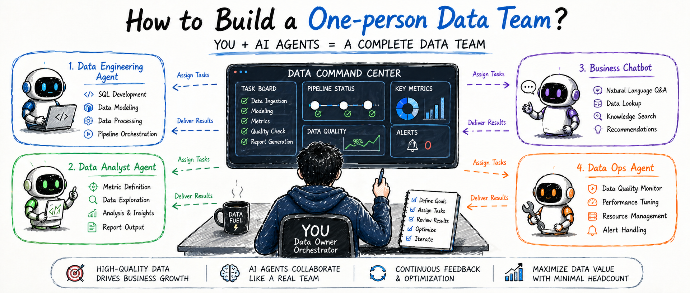
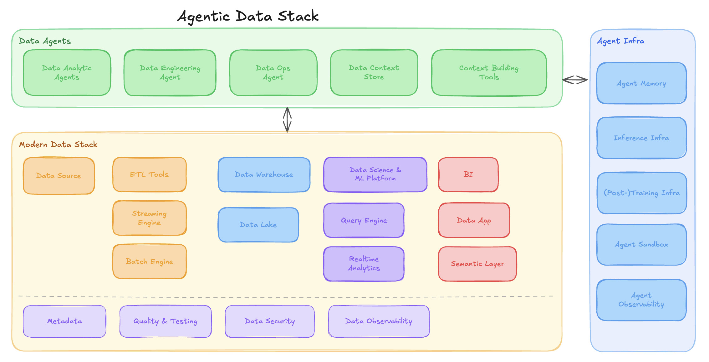
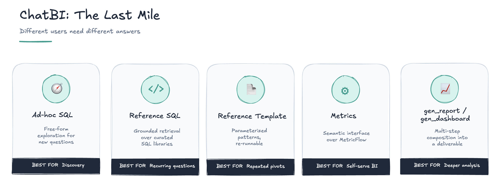
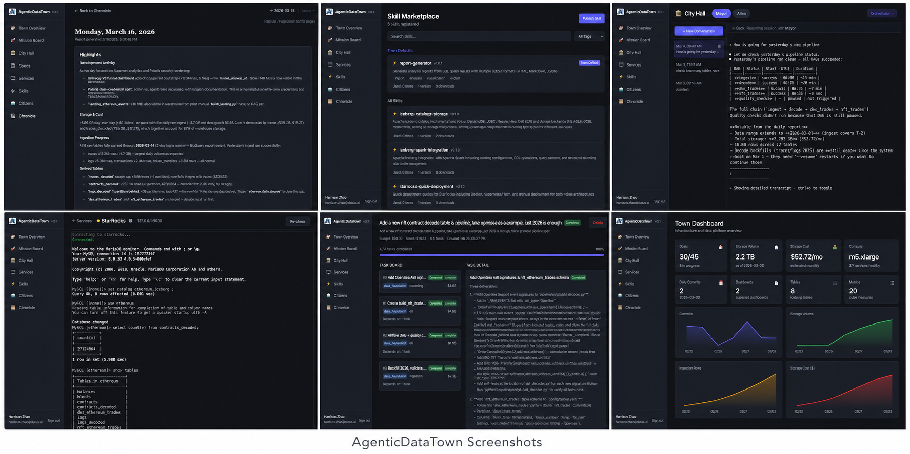
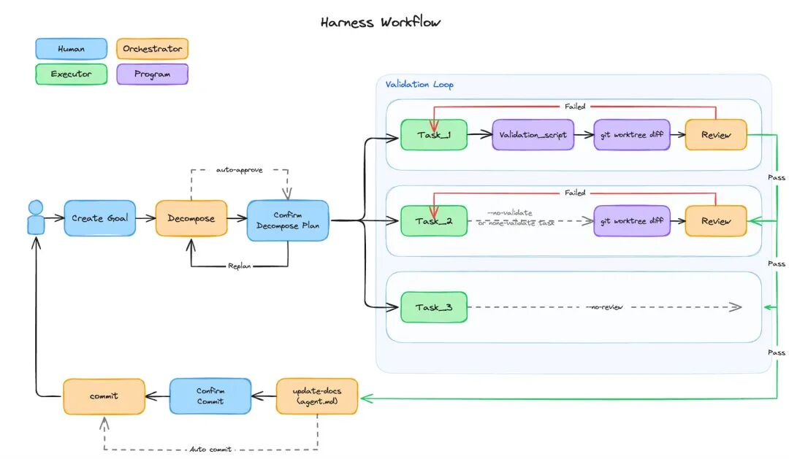

# One-person Data Team：Agent 时代的数据工程师

最近在硅谷参加的一场 [Data Engineering Open Forum][10]，这个活动是 [Data Engineer Things][1] 组织的线下社区会议，议程里有 Airbnb、Netflix、Databricks、OpenAI 等公司的分享。但是我觉得这场活动最有意思的不在某个 keynote，而是会场外的焦虑，在硅谷裁员潮背景下每个数据工程师的焦虑。

演讲间隙，我参加了这个十来个人的小茶话会，这里有 figma/microsoft/apple 和一些初创公司的数据工程师，大家坐在一起聊各自的项目，困扰和经验。大家的共识很微妙：AI 确实提高了效率，但老板并不会因此少给你活，反而会觉得你应该接住更多需求、更快交付更多结果。和 keynote 中的数据 infra 厂商，或者大厂的招聘者在讲什么是强大的 Data agent、new data infra、Full stack data engineers 不同，场下聊的是我该如何在 Agent 时代保持自己的价值和抵抗这波 AI hype：

因此这篇文章，我就想聊聊：

1. 为什么需要 One-person Data Team
2. Full stack data engineer 真正的核心能力是什么
3. ChatBI 的最后一公里和前面的几百公里
4. 如何构建 Data Engineering 自己的 Harness
5. How to get started

## Why One-person Data Team？

软件工程在过去一年中发生了一次巨大角色融合。最早一个团队里有前端、后端、测试、运维、产品，大家靠 Jira、PRD、会议和各种对齐来协作。但随着 coding agent 的普及，这些边界在不断消失。

数据工程也在经历同样的事情。

传统数据团队里有数据工程师、数据分析师、BI 工程师、指标平台团队、数据治理团队、数据质量团队。每个角色都有自己的工具，每个交接点都有一次上下文损耗。业务提需求给分析师，分析师找数据工程师，数据工程师找表，写 SQL，改 pipeline，交付表，BI 工程师做 dashboard，业务再反馈说这个指标不对。

在人的时代，这叫分工。
在 agent 的时代，这是延迟。

因为在 agent 驱动的交付链路里，人与人之间每多一次传递，就多一次效率折损。每次额外的人与人沟通都可能让 context 被切碎，让原始意图被转译，让责任边界变得模糊。我们见过太多历史遗留的问题：来源不明的表、没人敢动的 SQL、含义暧昧的字段。有些来自上游日志和 TP 系统的复杂语义，还有些是外包留下的长期包袱。

新时代的效率提升，并不是个体横向吃掉所有 SQL 开发或者报表开发，或者他需要用一个 agent(team) 来端到端的完成任务。一个懂业务语义、懂数据工程、懂验证机制、懂 agent harness 的人，可以用 AI 管理一个虚拟的数据团队。

## Full stack data engineers 的核心能力

OpenAI 的 Head of Data Engineering [Paul Ellwood][2] 在面对"你觉得 Data engineering 现在最重要的是什么"的时候，他的回答是 **Semantic ownership & responsibility**。

这里 semantic 并非狭义的指标平台，而是广义的指标的定义的权力和责任，之前这个事情往往是数据分析师（业务）负责定义（ownership），数据工程负责维护（responsibility），但是模型让 table/指标/pipeline 都慢慢退化成一个个 skills & agentic loop，业务交付的内容也是越来越多的 chatbot，然而自然语言的歧义性和模型的 next token prediction 的机制让这个中间一定需要一个人来保证稳定，或者在可见的未来这里都需要人来负(bei)责(guo)。

- 要么是工程师开始理解业务，能够响应业务
- 要么是分析师也能了解底层，维护指标构建 pipeline

这也意味着新的 full stack data engineer，需要具备三个核心能力：

### 1. Semantic 定义能力

就是和业务坐下来，能够把业务逻辑和数据目标聊清楚，模糊的业务语言，转化成清晰的数据定义。

什么叫活跃用户，GMV 是否含退款，新客按注册算还是首单算，门店收入按下单门店还是履约门店归属——这些问题都不是 SQL 问题，而是语义问题。谁能定义清楚这些规则，谁就在定义组织的数据语言。

新时代的 dashboard 和报告的形式在不断变换，但是要交付的依旧是对业务的指标理解方式和拆解，分析，监控，预测的能力。

### 2. Agentic Data Stack 的构建能力

未来的数据栈不只是堆工具，而是管理一组持续工作的 agents，所有的 data infra 厂商都开始声称自己从为人服务，转化成为 agent 服务的时候，如何理解这些组件的定位和组织结构就是关键之一。

> Modern data stack design for humans. Agentic data stack design for agents.

然后作为数据架构师的角色，选择合适湖仓架构，流批链路，质量控制框架，任务调度框架，并把它们接入到一套 agent infra 中就成了基础。

Agentic data stack 本质上就是给 data engineering agent 构建一个长程持续执行任务的环境，相对代码的容器 sandbox，或者一些通用 agent 的浏览器，抑或是云端的 e2b 类的，数据需要一个外部服务的 sandbox，因为数据只有对 database/etl pipeline/BI 工具构建可重入可回滚的版本，可惜当前大部分大数据服务还没有足够好的 versioning & rollback 能力，因此我们当前还需要给这个生态打上不少补丁。

### 3. 从历史数据中构建 Agent native context 的能力

企业里最有价值的数据知识，往往不在产品手册里，而藏在过去几年留下的 SQL、报表、文档、字段备注、群聊记录和人的经验里。

哪些表可信，哪个指标有坑，过去类似问题怎么分析过，为什么某张表不能直接 join——这些隐性知识决定了 agent 是否真正可用。谁能把这些历史资产沉淀成结构化 context，谁就能让 agent 快速进入生产环境，并随着使用持续进化。

就像写代码一样，绝大多数人写不过 AI，未来写 SQL、搭 pipeline、做 dashboard 也会越来越如此。真正稀缺的能力，不再是单次产出，而是定义语义、组织系统、沉淀 context。

## 未来的数据工程交付是 ChatBI 么？

AI 改变的不仅仅是数据工程的生产，也完全变革了它的消费侧。最近国内一直在讨论 ChatBI 是不是伪需求：如果 AI 只能给出 80%、90%，甚至 99% 准确率的答案，这件事是否有价值？我做过不少 Text2SQL benchmark 后最大的感受是，问题往往不在 SQL 生成本身，而在自然语言天然存在歧义。把一个 chatbot 直接交给不理解数据口径的用户，风险依然很高。

没有数据工程 context 支撑的 ChatBI，往往只是无根之水。最终的准确性，往往还是要落回到宽表的定义，指标的定义，reference sql/template 的构建，过去半年多在我们积累的案例和经验中，只有带上 scoped context 限制的 subagent 才能保证准确，而这里暂时也无法离开人工的设计。

因此，现阶段更现实的 ChatBI 交付方式，不是一个独立的 chatbot，也不是完全替代 dashboard 和 report，而是增强它们。

先通过 dashboard / report 向用户解释关键业务结构和核心指标，再让用户基于对应场景的 subagent 自由追问，这是更稳定、更容易被接受的路径。业务侧常见的自助明细取数，也更适合建立在 reference SQL、reference template 和 metrics 之上，而不是直接生成原始 SQL。基于当前已经存在的 dashboard 构建围绕主题的 copilot，并将之前的报告分析思路转化成可复用的 skills，生成日报周报。并最终将这些通过自我反馈的 subagent 在打磨成熟以后暴露成数据服务 API 或者 MCP 给其他下游 Agent 复用。

让 Full stack data engineer 通过构建 context 来初始化的 subagent，并通过 feedback loop 来自动优化 memory 和 context 是比预定 workflow 更有效更持久的交付方式。

## Harness data engineering

最近 Harness 已经成了一个 buzzword。

但是 Skills 在 data engineering 里已经快速铺开，subagent 用来隔离 context、plan mode 用来处理长程任务，也逐渐成为大家接受的工作方式。

但如果说交付侧的核心难点是准确性和 context，那么效率侧真正的关键，其实并非"让模型多写一点 SQL"，而是**如何通过有效的 validation，把更多操作从 hand-holding 变成 hands-off**。

我跟很多数据工程师聊过，大家普遍体感都很一致：SQL 开发本身并没有像 coding 那样复杂，真正拖慢整个 agentic loop 的，往往是那些细小但致命的错误：一个字段口径不对、一个 join 条件漏了、一个指标过滤没继承、一个 dashboard 配置错了，都会让后续结果全部失真。随着模型能力增强、context 更完整，这个瓶颈已经逐渐从"生成 SQL"转移到"验证 table / metrics / dashboard 是否真的符合要求"。

而这恰恰又是每个公司最不一样的地方。每家公司都有自己的建表规范、任务规范、指标口径和数据质量要求。只有把模型的能力和 SQL review、data quality、lineage、历史任务经验结合起来，才能真正把这些脏活累活自动化掉。

当我真的拿起 Claude code，构建了一个端到端的数据工程任务的时候，要实现一个长程稳定可交付的数据工程链路，依旧困难重重。在烧掉大几十亿 opus 的 token 以后，我构建了一个 AgenticDataTown 的 POC，在一个新的 harness 框架下，人类只需要关注长程的任务发布，Spec 的规范建设，以及 AI 生成的日报 review，就从 0 搭建起了一个从 Bigquery 同步数据到 Iceberg，通过多层数仓加工 duckdb + starrocks + Airflow + superset 的完整数据架构（后续来逐步介绍这个实战）。

而我理解的 data engineering harness，核心不是再包一层 workflow，而是构建一套持续完善的 validation loop：从历史 SQL 和任务中积累 context，抽取血缘和隐含规则，沉淀成逐步完善的 validation spec；再在 `gen_sql`、`gen_metrics`、`gen_dashboard` 这些关键环节中，通过规范化的工具调用完成检查、反思和修正。

而这也是我们不断优化 Datus agent 的目标和动力源。

过去半年，我们一直在尝试把这些判断和实验产品化，Datus 0.3 是当前阶段的一次集中交付。

## Datus 0.3 & playground

Datus 作为一个开源的 Data engineering agent，目标就是帮助超级个体完成端到端的数据开发和指标构建，并交付 agent 时代下的 api/chatbot/semantic layer，他可以对接整个数据工程的生态组件，完成数据工程的完整开发，从历史的 SQL/dashboard/文档中生成 Data context，进行指标的定义和开发并交付可复用的 chatbot/dashboard/report。

在最新的 0.3 中我们补充了大量功能，同时我们也发布了一个公开免费使用的 Datus studio playground，欢迎大家体验。0.3 核心功能包括：

- **场景完善**：Subagent 完整的 `gen_table` / `gen_semantic_model` / `gen_metrics` / `gen_sql` / `gen_job` / `gen_report` / `gen_dashboard`，全链路覆盖数据工程；每个 subagent 可自定义 spec validation，让 validation loop 更加稳定达到数据工程的要求，把数据工程与指标层的开发、测试、交付闭环。
- **服务接入**：Service 完善，新增 Scheduler adaptor 支持 Airflow，新增 BI Adaptor 支持 Superset & Grafana。
- **模型支持**：新增对 Codex OAuth、Claude Subscription、Coding Plan、OpenRouter、MiniMax、GLM 的支持。
- **Datus-Chat 优化**：完整的流式 API，新 Web 页面更精简，一行 JS 即可嵌入三方网站；新增 Slack 与飞书 channel。
- **Subagent 级 memory**：Datus-Chat 中的反馈通过 feedback 通道沉淀回对应 subagent，形成长期学习闭环。
- **Reference Template**：补齐 ChatBI 第四种形态，把重复 pivot 类问题的结果稳定下来。
- **Permission Mode**：同一 agent 在 normal / auto / dangerous 三档切换，配合细粒度工具权限可以实现不同场景的切换。

### Try OpenSource

- [github repo][3]
- [Quickstart][4]
- [e2e data engineering pipeline][5]
- [Dashboard copilot][6]

### Try Datus-studio playground

[Datus-studio playground][7]：这里提供 8 个预设的 demo 可以参考，覆盖自助查数，指标构建，数据质量，分层数仓加工，可迭代的 chatbot，指标归因等场景。可以帮助更快理解 full stack data engineer 的工作方式。

**Vscode plugin**：如果你需要纯本地 + IDE 的环境，我们会在五一之后发布插件。

更多信息以及企业版合作请咨询[官网][8]。

加入开源社区：关注海外社区加 [Slack channel][9] / 中文讨论请后台私信加微信群。

## 参考资料

[1]: https://www.dataengineerthings.org/ "Data Engineer Things"
[2]: https://www.linkedin.com/in/pellwood/ "Paul Ellwood"
[3]: https://github.com/Datus-ai/Datus-agent "github repo"
[4]: https://docs.datus.ai/getting_started/Quickstart/ "Quickstart"
[5]: https://docs.datus.ai/dev/getting_started/data_engineering_quickstart/ "e2e data engineering pipeline"
[6]: https://docs.datus.ai/dev/getting_started/dashboard_copilot/ "Dashboard copilot"
[7]: https://studio.datus.ai/ "Datus-studio playground"
[8]: https://datus.ai/ "官网"
[10]: https://www.dataengineeringopenforum.com/ "Data Engineering Open Forum"

- [1] Data Engineer Things: <https://www.dataengineerthings.org/>
- [2] Paul Ellwood: <https://www.linkedin.com/in/pellwood/>
- [3] github repo: <https://github.com/Datus-ai/Datus-agent>
- [4] Quickstart: <https://docs.datus.ai/getting_started/Quickstart/>
- [5] e2e data engineering pipeline: <https://docs.datus.ai/dev/getting_started/data_engineering_quickstart/>
- [6] Dashboard copilot: <https://docs.datus.ai/dev/getting_started/dashboard_copilot/>
- [7] Datus-studio playground: <https://studio.datus.ai/>
- [8] 官网: <https://datus.ai/>
- [10] Data Engineering Open Forum: <https://www.dataengineeringopenforum.com/>
