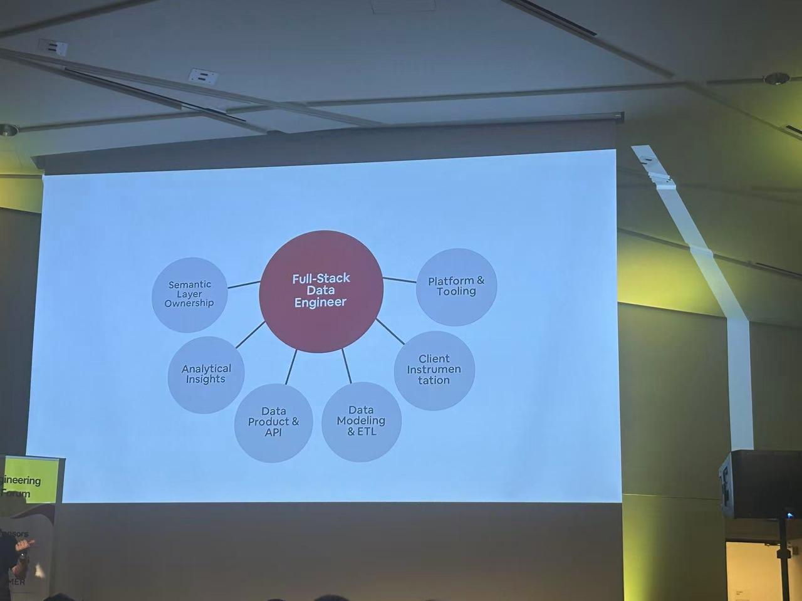

# One-person Data Team: The Data Engineer in the Age of Agents

I recently attended a [Data Engineering Open Forum][10] in Silicon Valley — an offline community meetup organized by [Data Engineer Things][1], with talks from Airbnb, Netflix, Databricks, OpenAI and others. But what stuck with me more than any keynote was the conversation outside the auditorium: as AI rapidly reshapes how software is built, data engineers everywhere are asking the same question — where does this role go from here?

Between sessions I joined a small roundtable of about a dozen people — data engineers from Figma, Microsoft, Apple, and a few startups — sitting together to swap projects and lessons learned. A pretty common takeaway: AI does make us more efficient, but the demand side ratchets up in lockstep. The faster AI lets you ship, the more your manager expects you to take on. While the data infra vendors and big-company recruiters on stage were preaching what makes a great Data agent (see [OpenAI's talk][11]), the new data infra (Databricks, LanceDB, Astronomer), or the full-stack data engineer (Airbnb's Datako), the off-stage conversation was about something more fundamental: where the data engineer's value anchor should sit in the agent era —

So in this post, I want to talk about:

1. Why we need a One-person Data Team
2. What the real core competencies of a full-stack data engineer are
3. The last mile — and the hundreds of miles before it — of text-to-SQL
4. How to build your own harness for data engineering
5. How to get started

## Why One-person Data Team?

Software engineering went through a massive role-fusion over the past year. A team used to have frontend, backend, QA, ops, and product, all coordinating through Jira, PRDs, meetings, and endless alignment. As coding agents went mainstream, those boundaries kept dissolving.

Data engineering is going through the same thing.

A traditional data team has data engineers, data analysts, BI engineers, a metrics platform team, a data governance team, a data quality team. Every role has its own tools, and every handoff bleeds context. The business hands a request to the analyst, the analyst pings the data engineer, the data engineer hunts for the table, writes the SQL, patches the pipeline, ships a table, the BI engineer builds a dashboard, and then the business comes back saying the metric is wrong.

In the human era, we called this division of labor.
In the agent era, this is just latency.

In an agent-driven delivery chain, every additional human-to-human handoff burns efficiency. Every extra round of human communication shreds context, translates the original intent, and blurs the lines of responsibility. We've all seen too much legacy debris: tables of unknown origin, SQL nobody dares to touch, fields with murky meanings. Some come from messy upstream logs and TP system semantics; others are long-standing baggage left by outsourced work.

The new efficiency gain isn't a single person horizontally swallowing all the SQL development or report building — it's that they need an agent (team) to deliver tasks end to end. One person who understands business semantics, data engineering, validation mechanisms, and agent harness can use AI to manage a virtual data team.

## The Core Competencies of a Full-stack Data Engineer

Airbnb made the most concrete case for what this role looks like. In [Jerry Wang][12]'s keynote, he walked through their definition of a full-stack data engineer — one role spanning **semantic layer ownership, analytical insights, data product & API, data modeling & ETL, client instrumentation, and platform & tooling**. Instead of staffing six specialist tracks, Airbnb is using an internal agent system called **Datako** to help individual engineers grow across all of these dimensions.

*Slide from [Jerry Wang][12]'s keynote at the forum.*

OpenAI is converging on the same idea from a different angle. Their Head of Data Engineering, [Paul Ellwood][2], when asked "what's the most important thing in Data engineering right now?", answered: **Semantic ownership & responsibility**.

Semantic here doesn't mean a metrics platform in the narrow sense — it means the broad authority and responsibility over how metrics are defined. Historically, the data analyst (or business) owned the definition (ownership) and the data engineer maintained it (responsibility). But models are gradually turning tables, metrics, and pipelines into discrete skills and agentic loops, and what the business consumes is increasingly a chatbot. Given the inherent ambiguity of natural language and the next-token-prediction nature of models, there has to be a human in the middle to keep things stable — or, in the foreseeable future, to take the blame.

- Either the engineer starts to understand the business and respond to it directly,
- Or the analyst learns the underlying stack and maintains the metric pipelines themselves.

Which means the new full-stack data engineer needs three core competencies:

### 1. Semantic definition

Sit down with the business, talk through the business logic and data goals clearly, and translate vague business language into precise data definitions.

What counts as an active user? Does GMV include refunds? Is a new customer counted at registration or first order? Does a store's revenue belong to the store that took the order or the one that fulfilled it? These aren't SQL questions — they're semantic ones. Whoever can pin these rules down is defining the organization's data language.

The shape of dashboards and reports keeps changing, but what we deliver is still the ability to understand, decompose, analyze, monitor, and forecast business metrics.

### 2. Building the Agentic Data Stack

The future data stack isn't just a pile of tools — it's a fleet of agents that work continuously. As every data infra vendor pivots from "serving humans" to "serving agents," understanding where each component fits and how they're organized becomes critical.

> Modern data stack design for humans. Agentic data stack design for agents.

In the data architect role, you pick the right lakehouse architecture, streaming/batch path, quality control framework, and scheduling framework, and wire them into a unified agent infra — that's the foundation.

The agentic data stack is essentially a long-running, persistent execution environment for data engineering agents. Where code agents have container sandboxes, general agents have browsers, and cloud-based ones have something like e2b, data needs an external-service sandbox — because data only becomes safely operable on databases / ETL pipelines / BI tools when there's reentrant, rollback-able versioning. Unfortunately, most big data services today don't have good versioning & rollback yet, so we still have to patch this ecosystem ourselves.

### 3. Building agent-native context from historical data

The most valuable data knowledge in any company isn't in product handbooks — it's hidden in years of accumulated SQL, reports, docs, field comments, group chats, and people's experience.

Which tables are trustworthy, which metrics have landmines, how a similar question was analyzed last time, why a certain table can't just be joined directly — this tacit knowledge decides whether an agent is actually usable. Whoever can crystallize these historical assets into structured context can put the agent into production fast and let it keep evolving with use.

Just like with code, most people can't outwrite AI — and the same will increasingly be true of writing SQL, building pipelines, and creating dashboards. The truly scarce skill is no longer the one-shot output, but defining semantics, organizing systems, and accumulating context.

## Beyond Text-to-SQL: Context Is the Real Deliverable

AI didn't just change how data engineering is produced — it transformed how it's consumed. There's an ongoing debate about whether **text-to-SQL** — the "ask your database in English" pitch shipped by Vanna, Defog, TextQL, Snowflake Cortex Analyst and a long list of others (in Chinese circles this gets branded "ChatBI") — is a real demand. If the model can only deliver 80%, 90%, or even 99% accurate answers, is it actually useful? Having run plenty of text-to-SQL benchmarks myself, my takeaway is that the bottleneck usually isn't SQL generation — it's the inherent ambiguity of natural language. Pointing a raw text-to-SQL chatbot at users who don't understand the underlying data semantics is still risky.

A text-to-SQL interface with no data engineering context underneath it has nothing to stand on. Real accuracy comes from wide-table definitions, metric definitions, and curated reference SQL and reference templates. Across the cases we've shipped over the last six-plus months, only subagents bounded by scoped context have consistently hit the accuracy bar — and even those still need human design.

So the realistic delivery shape today isn't standalone text-to-SQL, nor a wholesale replacement for dashboards and reports. It's **text-to-metrics**, **reference SQL**, and **reference templates**, layered on top of dashboards and reports as the user's entry point.

Use dashboards and reports to anchor users in the key business structure and core metrics, then let them follow up through a scenario-scoped subagent. That's stable, and users actually accept it. Self-serve detail querying belongs on top of reference SQL, reference templates, and metrics — not raw SQL generation. Build topic copilots on the dashboards you already have, distill prior analysis patterns into reusable skills, and let those skills produce daily and weekly reports. Once these self-correcting subagents mature, expose them as data service APIs or MCPs so downstream agents can reuse them.

Letting full-stack data engineers seed subagents with context, then letting feedback loops automatically refine memory and context, is more durable than any predefined workflow. In the end, it's all about **context building** — that's what turns a 90%-accurate text-to-SQL toy into a delivery the business actually trusts.

## Harness Data Engineering

"Harness" has become a buzzword lately.

But Skills have already spread quickly inside data engineering, and using subagents to isolate context and plan mode to handle long-horizon tasks is gradually becoming a way of working that everyone accepts.

If the core challenge on the delivery side is accuracy and context, then the real key on the efficiency side isn't "have the model write more SQL" — it's **how to use effective validation to move more operations from hand-holding to hands-off**.

I've talked with a lot of data engineers, and the felt experience is consistent: SQL development itself isn't as complex as coding. What actually slows down the agentic loop are the small but lethal mistakes — a wrong field semantic, a missing join condition, an unpropagated metric filter, a misconfigured dashboard — any one of which distorts everything downstream. As models get more capable and contexts get richer, the bottleneck has shifted from "generating SQL" to "validating whether the table / metrics / dashboard actually meets requirements."

And that's exactly where every company differs the most. Each company has its own table conventions, job conventions, metric semantics, and data quality requirements. Only by combining the model's capability with SQL review, data quality, lineage, and historical task experience can these dirty, tedious tasks really be automated away.

When I actually picked up Claude Code and built an end-to-end data engineering task, delivering a stable, long-horizon data engineering pipeline turned out to still be hard. After burning through a few billion Opus tokens, I built an AgenticDataTown POC: under a new harness framework, a human only needs to focus on long-horizon task issuance, spec authoring, and reviewing AI-generated daily reports — and we built up from scratch a complete data architecture syncing data from BigQuery to Iceberg, processed across multiple warehouse layers via duckdb + StarRocks + Airflow + Superset (more on this in follow-up posts).

The way I think about a data engineering harness: the core isn't wrapping yet another workflow layer, it's building a continuously self-improving validation loop. Accumulate context from historical SQL and tasks, extract lineage and implicit rules, distill them into a progressively richer validation spec; then in critical stages like `gen_sql`, `gen_metrics`, `gen_dashboard`, use standardized tool calls to perform checks, reflection, and correction.

That's also the goal and motivation behind our continuous work on the Datus agent.

Over the past six months, we've been trying to productize these judgments and experiments. Datus 0.3 is the current consolidated delivery.

## Datus 0.3 & Playground

The fastest way to see what a one-person data team looks like in practice is the **[Datus-studio playground][7]** — 8 preset demos covering self-serve querying, metric construction, data quality, layered warehouse processing, iterable chatbots, and metric attribution. No setup, free to use.

Datus is the open-source data engineering agent that powers it. The core idea: a complete set of full-pipeline subagents — `gen_table` / `gen_semantic_model` / `gen_metrics` / `gen_sql` / `gen_job` / `gen_report` / `gen_dashboard` — each with custom spec validation so the validation loop is stable enough for production. Context is built from your historical SQL, dashboards, and docs, and subagent-level memory turns every conversation into a feedback loop. Adapters cover Airflow, Superset, and Grafana; the model layer supports Codex OAuth, Claude Subscription, OpenRouter, MiniMax, and GLM.

To self-host, start from the [github repo][3] / [Quickstart][4], or walk through the [end-to-end data engineering pipeline][5] and [dashboard copilot][6] guides. A VSCode plugin for fully local + IDE use lands soon. For enterprise inquiries, see the [website][8]. Join the [Slack channel][9] for discussion.

## References

[1]: https://www.dataengineerthings.org/ "Data Engineer Things"
[2]: https://www.linkedin.com/in/pellwood/ "Paul Ellwood"
[3]: https://github.com/Datus-ai/Datus-agent "github repo"
[4]: https://docs.datus.ai/getting_started/Quickstart/ "Quickstart"
[5]: https://docs.datus.ai/dev/getting_started/data_engineering_quickstart/ "e2e data engineering pipeline"
[6]: https://docs.datus.ai/dev/getting_started/dashboard_copilot/ "Dashboard copilot"
[7]: https://studio.datus.ai/ "Datus-studio playground"
[8]: https://datus.ai/ "Official site"
[10]: https://www.dataengineeringopenforum.com/ "Data Engineering Open Forum"
[11]: https://www.youtube.com/watch?v=OTVVK0lDfqQ "OpenAI on Data agents"
[12]: https://www.linkedin.com/in/jerry-wang-aa813637/ "Jerry Wang (Airbnb)"

- [1] Data Engineer Things: <https://www.dataengineerthings.org/>
- [2] Paul Ellwood: <https://www.linkedin.com/in/pellwood/>
- [3] github repo: <https://github.com/Datus-ai/Datus-agent>
- [4] Quickstart: <https://docs.datus.ai/getting_started/Quickstart/>
- [5] e2e data engineering pipeline: <https://docs.datus.ai/dev/getting_started/data_engineering_quickstart/>
- [6] Dashboard copilot: <https://docs.datus.ai/dev/getting_started/dashboard_copilot/>
- [7] Datus-studio playground: <https://studio.datus.ai/>
- [8] Website: <https://datus.ai/>
- [10] Data Engineering Open Forum: <https://www.dataengineeringopenforum.com/>
- [11] OpenAI on Data agents (YouTube): <https://www.youtube.com/watch?v=OTVVK0lDfqQ>
- [12] Jerry Wang (Airbnb, full-stack data engineer / Datako keynote): <https://www.linkedin.com/in/jerry-wang-aa813637/>
